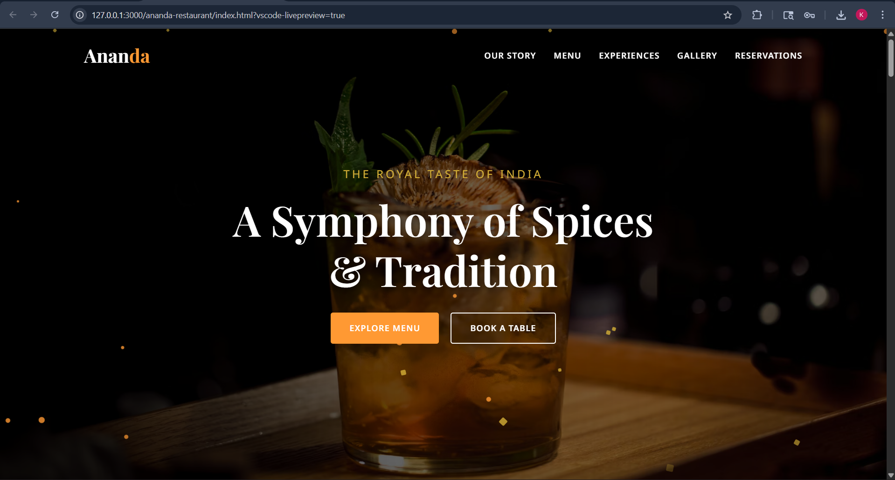
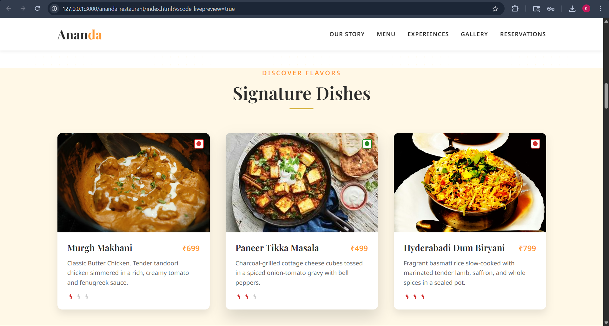
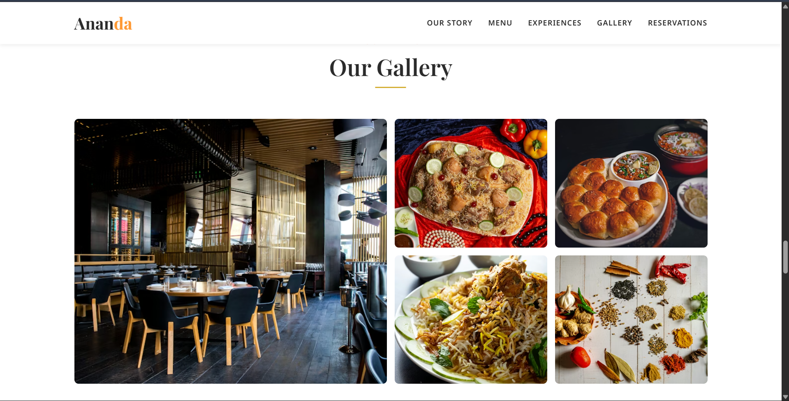
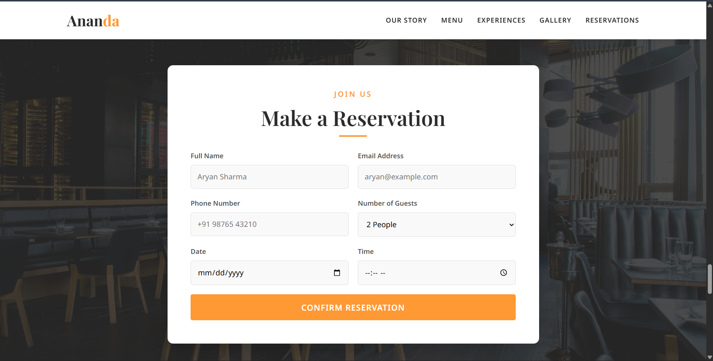

# 🍛 Ananda — Fine Indian Cuisine Website

A modern, fully responsive restaurant website designed to deliver a premium dining experience through elegant UI, smooth animations, and interactive features. Built using **vanilla HTML, CSS, and JavaScript** — no frameworks, no dependencies.

---

## 🔗 Live Demo 
👉 https://ananda-restaurant.netlify.app/

---

## 📸 Preview






---

## ✨ Features

* **Sticky Navigation** — shrinks and changes colour on scroll; hamburger menu on mobile
* **Hero Section** — full-viewport parallax background with animated floating spice particles
* **Scroll-Reveal Animations** — smooth fade/slide-in effects using IntersectionObserver
* **Interactive Menu** — dish cards with hover zoom, veg/non-veg indicators, spice-level icons
* **Regional Cuisine Section** — alternating layouts showcasing Indian diversity
* **3D Tilt Cards** — interactive perspective hover effect
* **Gallery + Lightbox** — click to view images in full screen
* **Reservation Form** — validation + simulated async submission
* **Merchandise Section** — add-to-cart toast notifications
* **Google Maps Integration** — location, contact, and timing details
* **Footer Section** — newsletter, social links, quick navigation

---

## 🧑‍💻 Tech Stack

* HTML5
* CSS3 (Flexbox, Grid, Animations)
* JavaScript (Vanilla JS)

---

## 🗂️ Project Structure

ananda-restaurant/
├── index.html
├── css/
│   └── styles.css
├── js/
│   └── main.js
├── assets/
├── .gitignore
└── README.md

---

## 🚀 Getting Started

```bash
git clone https://github.com/<your-username>/ananda-restaurant.git
cd ananda-restaurant
```

Open in browser:

```bash
start index.html
```

Or run a local server:

```bash
python -m http.server 8000
```

---

## 🛠️ Customisation

| What to change | Where          |
| -------------- | -------------- |
| Content / Text | index.html     |
| Colors / Theme | css/styles.css |
| Menu Items     | index.html     |
| Images         | assets/        |
| Form Logic     | js/main.js     |

---

## 🌐 Deployment

This is a static website — can be deployed easily on:

* Netlify
* Vercel
* GitHub Pages

---

## 📸 Image Credits

* Some images are sourced from Unsplash and used under their free license.
* Other images are used for educational/demo purposes only.
* All rights belong to their respective owners.
* These will be replaced with properly licensed assets in future updates.

---

## 👩‍💻 Author

**Kashish Bhiwapurkar**
Aspiring Python Developer | Future AI Engineer

---

## 📄 License

MIT License — free to use, modify, and distribute.

